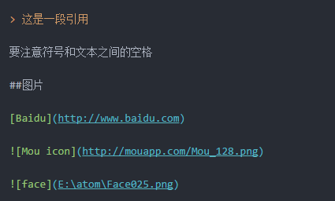

# 一级标题

A

B

C

D

E

F

G

## aaa

* 1
* 2
* 3

1. 1
2. 2
3. 3

## bbbbbb

> 这是一段引用

要注意符号和文本之间的空格

## eee

[Baidu](http://www.baidu.com)




我正在测试GIF录制，这段文字没被录制，继续录制


##cccc

| name               |       asd       |        zzz | asdasd |
|:------------------ |:---------------:| ----------:|:------:|
| sadaaaaaaaaaaaaaaa | asdsadsadsadsad | asdasddddd | 11111  |
| 12                 |     sadasd      |         22 |   44   |


***

**强调**


## ddd

```javascript
initModules: function (url) {
  var _this = this
  _this.feedback.modules = []
  _this.$http.get(url, {
    fail: function () {
      console.log('获取模块失败')
    }
  }).then(function (response) {
    var list = response.body.data.list
    var options = []
    list.forEach(function (item) {
      options.push({value: item.name, label: item.name})
    })
    _this.feedback.modules = options
  })
}

```
